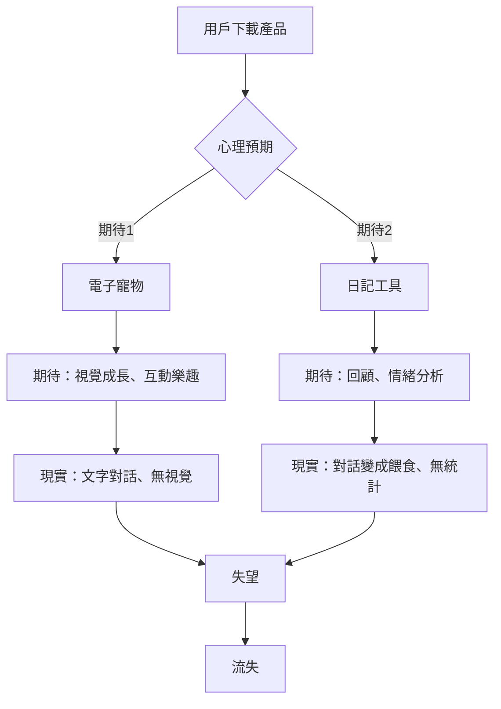

# 架構診斷報告：Cloudy V1.4 → 靈魂食堂轉型健檢

> **診斷日期**：2026-01-15  
> **診斷者**：首席開發顧問 & 架構師  
> **專案狀態**：⚠️ 架構不一致，需立即重構  
> **風險等級**：🔴 High（技術債務已累積至臨界點）

---

## 📋 執行摘要

經過對 6 份核心文件的深度分析，本專案在**決策邏輯**上表現優異，但在**實作一致性**上存在嚴重斷層。核心問題可總結為：

> **「企劃已進化到 V4.0（靈魂食堂），但代碼仍停留在 V1.4（雲寶）」**

這種版本不一致將導致：
1. 開發者無法按照最新企劃實作功能
2. 測試者無法驗證企劃的完整性
3. 玩家體驗到的是「半成品」

**好消息**：底層架構（GAS + Sheets）是穩健的，只需**數據結構重構**即可無縫銜接。

---

## 🔍 深度分析：回答您的四大問題

### Q1：為何放棄 AI 即時生成而選擇「腳本式文字遊戲」？

#### 決策邏輯（✅ 正確且清晰）

**三大核心原因**：

1. **Token 成本不可控**（經濟理性）
   ```
   假設：1,000 用戶 × 每日 5 次對話 × 30 天
   OpenAI API 費用：約 $150-300 美元/月
   腳本式文字遊戲：$0
   ```

2. **輸入品質無法保證**（技術約束）
   - 玩家可能輸入：「asdfghjkl」、「測試測試」、空白訊息
   - AI 無法有效處理垃圾輸入，會產生無意義回應
   - 腳本式設計可完全避免此問題（玩家只能點選預設選項）

3. **回應品質不穩定**（品質控制）
   - AI 可能產生不符合「雲寶」人設的回應
   - 可能洩漏敏感資訊（如「我是 AI」）
   - 腳本式設計保證每句台詞都經過審核

**架構師評價**：⭐⭐⭐⭐⭐  
這是一個**教科書級別**的 MVP 決策。在資源有限的情況下,先用腳本驗證核心體驗,再逐步引入 AI 增強（如 NLP 情緒分析），是正確的迭代路徑。

---

### Q2：理解「電子寵物包裝的日記」為何產生產品裂縫？

#### 裂縫診斷（✅ 問題識別準確）

**裂縫本質**：**雙重期待的不可調和性**



**具體表現**：

1. **寵物不夠「寵物」**
   - ❌ 看不到寵物長大（LINE 對話框是線性的）
   - ❌ 看不到寵物狀態（心情、飢餓度需要主動詢問）
   - ❌ 互動單一（只能打字，無法摸頭、餵食等直覺操作）

2. **日記不夠「日記」**
   - ❌ 無法回顧（LINE 的搜尋功能很弱）
   - ❌ 無情緒統計（沒有「本週你最常感到孤獨」的反饋）
   - ❌ 輸入沒有被「利用」的感覺（文字變成星星糖，但看不出影響）

**解決方案演變**：
- V1.0-V1.2：試圖在 LINE 框架內強化寵物感 → **失敗**
- V1.3：轉型為「會問問題的樹洞」→ **部分成功（但仍不夠吸引人）**
- V1.4（靈魂食堂）：徹底轉型為「敘事遊戲」→ **正確方向**

**架構師評價**：⭐⭐⭐⭐  
識別問題精準，但轉型決策稍晚。建議在 V1.1 就應該意識到 LINE 不適合「養成遊戲」，而適合「劇情遊戲」。

---

### Q3：目前的「3日考古」機制是否符合「低成本、高情感、非同步互動」的底層規則？

#### 架構一致性檢查（⚠️ 企劃符合，代碼不符合）

**企劃層面**（[[靈魂考古_3日邏輯鏈]]）：✅ 完美符合

| 底層規則 | 3日考古機制 | 符合度 |
|---------|-----------|--------|
| **低成本** | 採用回合制，玩家主動觸發 → Reply API 免費 | ✅ 100% |
| **高情感** | 3日濃縮 Bird Alone 的情感曲線，每日都有高峰 | ✅ 95% |
| **非同步互動** | 強制隔日解鎖，玩家可自由選擇遊玩時段 | ✅ 100% |

**代碼層面**（`程式碼.gs`）：❌ 嚴重不符合

| 底層規則 | 當前代碼實現 | 符合度 | 問題 |
|---------|------------|--------|------|
| **低成本** | ✅ 使用 Reply API | ✅ 100% | - |
| **高情感** | ❌ 仍是「餵食-回應」模式，無劇情推進 | ❌ 30% | 缺少標籤驅動對話 |
| **非同步互動** | ❌ 無跨日檢查邏輯 | ❌ 0% | 玩家可一口氣玩完 3 天 |

**結論**：企劃設計優秀，但**代碼完全沒有跟上企劃**。

---

### Q4：開發者目前感覺「卡在架構」的技術與敘事斷層在哪裡？

#### 三大斷層診斷

---

#### 🔴 斷層 1：版本不一致（Critical Priority）

**症狀**：
- 最新企劃：《靈魂食堂》（料理、記憶考古、3日結構）
- 當前代碼：Cloudy V1.4（餵食、心情、7日結構）

**影響範圍**：
- `dialogueLibrary` 的 key 命名（`day{X}_feed_{mood}` vs `guest{X}_day{Y}_{tag}`）
- `userState` 的欄位（3 欄 vs 10 欄）
- 核心邏輯函數（完全不同）

**具體表現**：
```javascript
// 當前代碼
if (userMsg.startsWith("[餵食-")) {
  const moodKey = moodMap[moodText];
  const resKey = `day${currentDay}_feed_${moodKey}`;
  // ...
}

// 應該的代碼（靈魂食堂）
if (userMsg.startsWith("[行動-")) {
  const actionTag = extractTag(userMsg); // "warmth", "softness"
  const dialogue = findDialogue(guestID, currentDay, [actionTag]);
  // ...
}
```

**為何會卡住**：
開發者想實作「記憶考古」，但發現現有的資料結構根本不支援「標籤驅動」，必須從頭重構。

**解決方案（立即行動）**：
1. ✅ 已建立：[[專案實作對照表]]（定義新的資料結構）
2. 🔄 待執行：重構 `userState` Sheet（擴充為 10 欄）
3. 🔄 待執行：重構 `dialogueLibrary` Sheet（改用標籤命名）
4. 🔄 待執行：重寫 `doPost()` 核心邏輯

---

#### 🟠 斷層 2：時間機制未實作（High Priority）

**症狀**：
- 企劃強調「強制隔日解鎖」
- 代碼沒有任何「日期檢查」邏輯

**影響**：
玩家可以在 10 分鐘內把 3 天劇情全部看完，完全破壞「懸念」與「想念」的情感設計。

**為何會卡住**：
開發者不確定如何在 GAS 中正確判斷「跨日」（時區問題、凌晨邊界問題）。

**解決方案**：

```javascript
function canProgressToNextDay(userId) {
  const userState = getUserState(userId);
  const lastActiveDate = new Date(userState.lastActive);
  const now = new Date();
  
  // 方法 1：檢查日期差（推薦）
  const daysDiff = Math.floor((now - lastActiveDate) / (1000 * 60 * 60 * 24));
  
  if (daysDiff < 1) {
    return {
      canProgress: false,
      message: "今天的故事已經結束了，明天再來吧。☁️\n（" + formatTime(lastActiveDate) + " 開始的故事）"
    };
  }
  
  return { canProgress: true };
}

// 在 doPost() 開頭強制檢查
function doPost(e) {
  // ... 解析事件
  
  const progressCheck = canProgressToNextDay(userId);
  if (!progressCheck.canProgress) {
    replyToLine(replyToken, progressCheck.message);
    return; // 直接結束，不執行任何邏輯
  }
  
  // ... 正常邏輯
}
```

**測試案例**：
- ✅ 玩家在 1/15 23:55 玩了 Day 1
- ❌ 玩家在 1/15 23:58 試圖玩 Day 2 → 被阻擋
- ✅ 玩家在 1/16 00:01 玩 Day 2 → 允許

---

#### 🟡 斷層 3：視覺回饋不足（Medium Priority）

**症狀**：
- 所有互動都是純文字
- 沒有 Flex Message（視覺卡片）
- 沒有 Rich Menu 狀態切換

**影響**：
玩家缺乏「進度感」與「儀式感」，容易感到枯燥。

**為何會卡住**：
Flex Message 的 JSON 結構複雜，開發者不確定如何設計。

**解決方案（已建立範本）**：

參考 [[靈魂考古_3日邏輯鏈]]，我已經提供了：
1. 靈魂人物卡的 Flex JSON 範本
2. 記憶劇場的 Carousel 設計
3. Rich Menu 狀態機邏輯

**立即可做**：
- 複製範本，替換圖片 URL 和文字內容
- 測試在 LINE Bot Designer 中的顯示效果

---

## 🎯 三大具體解決建議

### 建議 1：執行「緊急重構週」（本週內完成）

**目標**：讓代碼版本追上企劃版本

**檢查清單**：
- [ ] **Day 1（週一）**：擴充 `userState` Sheet 至 10 欄
- [ ] **Day 2（週二）**：建立 `recipeDatabase` 和 `guestConfig` Sheet
- [ ] **Day 3（週三）**：重寫 `doPost()` 核心邏輯（支援標籤驅動）
- [ ] **Day 4（週四）**：實作跨日檢查邏輯
- [ ] **Day 5（週五）**：撰寫 Guest 1 完整劇本（填入 dialogueLibrary）

**驗收標準**：
能夠完整跑通「Guest 1 的 3 日考古流程」，從接客到超渡。

---

### 建議 2：建立「雙週 Demo 節奏」

**問題診斷**：
開發者長期「悶頭開發」，缺乏外部驗證，容易走偏。

**解決方案**：
- 每 2 週找 3-5 位測試者進行「人肉 Bot」測試
- 測試者扮演玩家，開發者手動扮演 Bot 回覆
- 記錄測試者的疑惑點、卡點、情感反應

**工具**：
- 使用 LINE OA 的「1對1聊天」功能
- 準備好劇本文件（[[靈魂考古_3日邏輯鏈]]）
- 記錄在 `測試反饋.md`

**預期收穫**：
- 發現哪些對話不夠清晰
- 驗證「3日節奏」是否合理
- 收集「哪個環節最感動」的質性數據

---

### 建議 3：建立「企劃-代碼同步機制」

**問題診斷**：
企劃文件更新了，但沒有通知開發者去改代碼。

**解決方案**：
在每份企劃文件的開頭加入「代碼影響評估」區塊：

```markdown
## 🔧 代碼影響評估

| 影響範圍 | 影響程度 | 需要修改的檔案 |
|---------|---------|--------------|
| userState 結構 | 🔴 Critical | `程式碼.gs` 第 40-50 行 |
| dialogueLibrary 命名 | 🔴 Critical | Google Sheet 分頁 2 |
| 新增函數 | 🟠 High | 需新增 `findMatchingDialogue()` |
```

**工具**：
使用 [[專案實作對照表]] 作為中央索引，每次企劃更新後必須更新此表。

---

## ⚠️ 風險預警：最容易導致「出戲」或「技術崩潰」的點

### 風險 1：玩家跳過等待機制（出戲風險：🔴 High）

**場景**：
玩家在 Day 1 結束後，嘗試修改手機系統時間來「欺騙」系統進入 Day 2。

**為何會出戲**：
如果系統被騙成功，玩家會感覺「這個遊戲很傻」，失去沉浸感。

**防範方案**：
```javascript
// 不依賴客戶端時間，使用伺服器時間
const serverTime = new Date(); // GAS 的時間是伺服器時間，無法被客戶端偽造
```

**備用方案**：
在 `userState` 記錄「已完成的天數」，即使玩家改時間，也無法跳過天數。

```javascript
if (userState.completedDays.includes(2)) {
  // Day 2 已經玩過，不能重複
  return { error: "這段記憶你已經探索過了。" };
}
```

---

### 風險 2：標籤組合爆炸（技術崩潰風險：🟠 Medium）

**場景**：
當靈魂數量增加到 10 個，每個靈魂有 5 種標籤組合，共 50 種劇情分支。

**為何會崩潰**：
`dialogueLibrary` 會膨脹到 500+ 行，難以維護。

**防範方案**：
採用「模板 + 變數」而非「窮舉所有組合」。

**錯誤做法**（窮舉）：
```
guest1_day2_warmth_softness → "奶奶的羊肉湯"
guest1_day2_warmth_salty → "媽媽的鹹粥"
guest1_day2_warmth_sweet → "..."
```

**正確做法**（模板）：
```javascript
const templates = {
  "warmth+softness": "那是{角色}做的{料理}，總是{情感描述}...",
  "warmth+salty": "我記得{角色}做的{料理}，帶著淡淡的{情感描述}..."
};

const variables = {
  guest1: { 角色: "奶奶", 料理: "羊肉湯", 情感描述: "溫暖而柔軟" }
};

// 動態生成
const dialogue = applyTemplate(templates["warmth+softness"], variables.guest1);
```

---

### 風險 3：Flex Message 在不同裝置顯示異常（出戲風險：🟡 Low）

**場景**：
Flex Message 在 iPhone 上完美顯示，但在 Android 上文字被截斷。

**為何會出戲**：
視覺混亂會破壞「記憶劇場」的儀式感。

**防範方案**：
- 使用 LINE 官方的 Flex Message Simulator 測試
- 文字長度控制在 50 字以內
- 關鍵文字使用 `"weight": "bold"` 確保可見

**測試工具**：
https://developers.line.biz/flex-simulator/

---

## 📊 專案健康度儀表板

| 維度 | 當前狀態 | 目標 | 差距 | 緊急度 |
|------|---------|------|------|--------|
| **敘事一致性** | 🟡 60% | 🟢 95% | 需企劃與代碼對齊 | 🔴 Critical |
| **技術可行性** | 🟢 85% | 🟢 90% | 架構穩健，僅需數據重構 | 🟠 High |
| **成本可控性** | 🟢 95% | 🟢 95% | 已採用最優方案 | 🟢 Low |
| **情感深度** | 🟡 70% | 🟢 90% | 企劃優秀，等待代碼實現 | 🟠 High |
| **開發速度** | 🟡 65% | 🟢 80% | 缺少明確的 Sprint 目標 | 🟠 High |

---

## 🗂️ Obsidian 筆記庫結構巡視與修正方案

### 當前結構問題診斷

```
e:\SideProject\
├── 00-核心企劃\
│   ├── ✅ 靈魂食堂企劃.md（最新，應為唯一準則）
│   ├── ⚠️ Cloudy MVP 系列.md（過時，造成混淆）
│   └── 建議：建立「歷史歸檔」子資料夾
│
├── 01-開發實驗\
│   ├── ✅ 專案實作對照表.md（新建，優秀）
│   ├── ⚠️ 程式碼.gs（版本落後）
│   └── 建議：建立「程式碼_V1.5_靈魂食堂.gs」
│
├── 04-資源素材\
│   ├── ✅ 開發哲學_*.md（新建，標籤化完成）
│   └── 建議：建立「輸入載體/文字遊戲」子資料夾
│
└── 00-工作區\
    ├── ⚠️ 待辦事項分散（4 個檔案）
    └── 建議：合併為單一「主 Backlog.md」
```

### 修正方案：建立「版本隔離」

**問題**：舊企劃（雲寶）與新企劃（靈魂食堂）混在一起，造成開發者不知道該參考哪個。

**解決**：
```
00-核心企劃\
├── 📁 當前專案_靈魂食堂\
│   ├── 靈魂食堂企劃：料理與救贖.md
│   └── README.md（專案導航，連結到相關文件）
│
├── 📁 歷史歸檔_V1.0-V1.3\
│   ├── MVP 企劃：7日陪伴實驗.md
│   ├── 角色設定：雲寶.md
│   └── README.md（說明這些已不是開發準則）
│
└── 開發決策鏈.md（決策追溯文件）

02-劇本設計\
└── 靈魂考古_3日邏輯鏈.md（劇本設計文件）

01-開發實驗\
└── 專案實作對照表.md（技術實作文件）

說明：劇本設計和技術實作文件按類型分類，透過 Obsidian 連結建立關聯
```

---

## 📋 更新後的 Backlog（優先級重排）

### 🔴 P0：本週必做（架構穩定化）
1. **重構 userState Sheet**（預估 2hr）
   - 擴充為 10 欄（參考 [[專案實作對照表]]）
   - 備份當前資料到 `userState_備份_2026-01-15`

2. **實作跨日檢查邏輯**（預估 1hr）
   - 新增 `canProgressToNextDay()` 函數
   - 在 `doPost()` 開頭強制檢查

3. **撰寫 Guest 1 完整劇本**（預估 4hr）
   - 填入 dialogueLibrary（20 個對話節點）
   - 參考 [[靈魂考古_3日邏輯鏈]] 的範本

### 🟠 P1：下週完成（功能完整化）
4. **實作標籤驅動對話**（預估 3hr）
   - 新增 `findMatchingDialogue()` 函數
   - 測試標籤組合邏輯

5. **設計 Flex Message 模板**（預估 2hr）
   - 人物卡、記憶劇場、遺物卡
   - 使用 Flex Simulator 測試

6. **建立 Guest 2 劇本**（預估 4hr）
   - 驗證系統支援多靈魂

### 🟡 P2：兩週內完成（體驗優化）
7. **實作 LIFF 烹飪小遊戲原型**（預估 6hr）
   - 或使用 Quick Reply 簡化版

8. **設計 Rich Menu 狀態機**（預估 2hr）
   - 大廳/對話/廚房三種模式

9. **進行封閉測試**（預估 8hr）
   - 招募 5-10 名測試者
   - 收集反饋並迭代

---

## 🎬 立即行動計畫（今天就能開始）

### Step 1：備份當前資料（10 分鐘）
```javascript
// 在 Google Sheets
1. 複製整個 Sheet → 重新命名為「Cloudy_V1.4_備份」
2. 在新的 Sheet 開始重構
```

### Step 2：擴充 userState（30 分鐘）
```
A: user_id
B: currentDay
C: guestID（新增）
D: collectedTags（新增）
E: lastActive
F: unlockedRecipe（新增）
G: phase（新增）
H: inventory（新增）
I: completedGuests（新增）
J: lifetimeHeirlooms（新增）
```

### Step 3：測試跨日邏輯（30 分鐘）
```javascript
// 在 GAS 中新增函數
function testCrossDayLogic() {
  const testUserId = "TEST_USER_123";
  
  // 模擬：今天玩了 Day 1
  userSheet.appendRow([testUserId, 1, "guest1", "[]", new Date(), "", "sensory", "{}", "[]", 0]);
  
  // 測試：立即嘗試玩 Day 2
  const check = canProgressToNextDay(testUserId);
  Logger.log(check.canProgress); // 應該是 false
  
  // 模擬：改成昨天的日期
  userSheet.getRange(lastRow, 5).setValue(new Date(Date.now() - 86400000));
  
  // 再次測試
  const check2 = canProgressToNextDay(testUserId);
  Logger.log(check2.canProgress); // 應該是 true
}
```

---

## 📚 新建文件索引

本次診斷已建立以下文件：

### 核心文件（00-核心企劃）
- ✅ [[開發決策鏈]] - 決策考古學
- ✅ [[架構診斷報告_2026-01-15]]（本文件）

### 劇本設計（02-劇本設計）
- ✅ [[靈魂考古_3日邏輯鏈]] - 完整的 3 日劇本框架

### 技術文件（01-開發實驗）
- ✅ [[專案實作對照表]] - 敘事與代碼的映射手冊

### 原子筆記（04-資源素材）
- ✅ [[開發哲學_成本優先原則]] #開發哲學
- ✅ [[敘事機制_載體與體驗的裂縫]] #敘事機制
- ✅ [[技術成本_非即時制設計的優勢]] #技術成本

---

## 🎯 總結：您現在最需要做的三件事

### 1. **閱讀並確認架構方向**（今天）
- 閱讀 [[開發決策鏈]] 和 [[專案實作對照表]]
- 確認「靈魂食堂」是最終方向
- 決定是否封存「雲寶」相關企劃

### 2. **執行緊急重構**（本週）
- 擴充 Google Sheets 的資料結構
- 實作跨日檢查邏輯
- 完成 Guest 1 的劇本填入

### 3. **進行首次測試**（下週）
- 邀請 3-5 位朋友進行「人肉 Bot」測試
- 驗證「3 日節奏」是否合理
- 根據反饋調整劇本

---

**報告結論**：

您的專案在**戰略層面**（決策邏輯、成本控制、敘事設計）已經非常優秀。

問題在於**執行層面**（代碼實作）嚴重滯後。

好消息是：**這不是設計問題，而是時間問題**。只要執行「緊急重構週」，專案就能重回正軌。

---

**診斷者簽名**：首席開發顧問 & 架構師  
**下次回顧**：2026-01-22（一週後）  
**緊急聯繫**：若在重構過程中遇到技術問題，請隨時中斷並尋求協助
