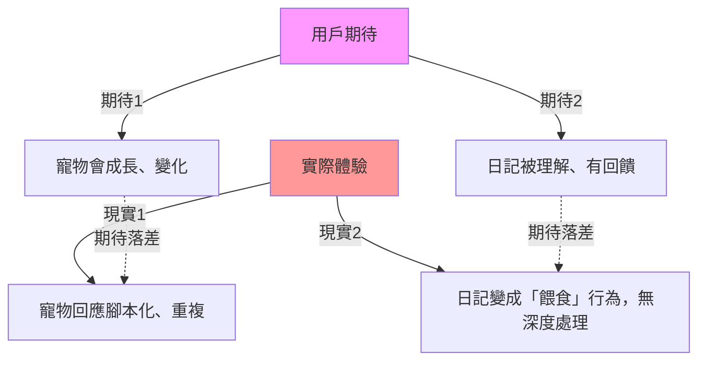

# 開發決策鏈：從 Cloudy V1.0 到靈魂食堂的架構演變追溯

> **文件定位**：專案架構師視角的決策考古學  
> **建立日期**：2026-01-15  
> **基於文件**：[[AI對談紀錄]]、[[寵物日記載體轉換評估]]、[[Line OA 文字遊戲 MVP 開發指南]]

---

## 📋 執行摘要

本專案經歷了 **4 次關鍵轉型**，從「AI 日記陪伴」走向「腳本式文字遊戲」，最終定位為「料理喚起記憶的靈魂擺渡」。每次轉型都源於對**成本結構**、**技術可行性**與**敘事完整性**的權衡。

---

## 🔀 決策節點時間軸

### ❌ 決策點 0：AI 即時生成方案的放棄（理論階段）

**原始假設**：
- 使用 OpenAI API 讓 AI 根據玩家的日記輸入即時生成個人化回覆
- 寵物會「理解」玩家的情緒並給予共鳴性反饋

**放棄原因（AI對談紀錄第 33 行）**：
1. **Token 成本不可控**：API 呼叫費用隨對話長度指數成長
2. **玩家輸入無法預測**：可能輸入無意義內容、惡意測試、或超長文本
3. **品質一致性問題**：AI 可能產生不符合角色人設的回應

**替代方案啟動**：
> 「先以可以兼容 ai 的文字遊戲作為框架」  
> → 引入**腳本式對話 + 關鍵字觸發**的混合架構

---

### ✅ 決策點 1：LINE OA 作為 MVP 載體（載體選擇）

**選擇理由（AI對談紀錄第 19-26 行）**：

| 維度 | 理由 | 隱含風險 |
|------|------|----------|
| **市場滲透** | LINE 在台灣最多人用，測試好找人 | 用戶注意力被大量聊天分散 |
| **開發速度** | 不用額外寫代碼，快速驗證 | 被平台功能限制（無法做複雜互動） |
| **介面適配** | 有像 GPT 的聊天介面，適合「文字灌溉」 | 缺乏視覺回饋（寵物成長感弱） |

**架構師診斷**：
- ✅ **正確決策**：在 MVP 階段，LINE OA 是最低成本的驗證工具
- ⚠️ **隱性債務**：產品若要規模化，必須面對 **LINE 推播費用** 與 **介面天花板** 兩大瓶頸

**應對策略（已於 AI對談紀錄中提出）**：
- 採用「拉取式（Pull-based）」設計：玩家主動觸發 → Bot 被動回應（免費）
- 避免「推播式（Push-based）」：Bot 主動發送 → 每則計費

---

### 🔄 決策點 2：從「電子寵物日記」到「文字遊戲框架」（產品定位裂縫）

**問題診斷（AI對談紀錄第 27 行）**：
> 「以電子寵物包裝的日記產生了產品裂縫」

**裂縫本質分析**：



**架構師診斷**：
問題不在技術實現，而在**產品敘事的自洽性**：
1. 如果定位是「日記」→ 玩家期待回顧、搜尋、情緒分析
2. 如果定位是「寵物」→ 玩家期待互動、成長、視覺變化
3. 現有設計既不是完整的日記工具，也不是完整的養成遊戲

**轉型決策**：
引入 **4 種敘事框架**（AI對談紀錄第 37-110 行）：
1. 記憶考古學 (Memory Archaeology)
2. 時間迴圈解謎 (Time Loop Mystery)
3. 靈魂擺渡模擬 (Soul Ferrying)
4. 非同步善意交換 (Kindness Exchange)

---

### ✅ 決策點 3：「時間迴圈 + 靈魂擺渡」的融合（AI對談紀錄第 186 行）

**最終選擇**：
> 「如果我想要迴圈機制+靈魂擺渡的劇情框架」

**設計核心（AI對談紀錄第 197-253 行）**：
- **設定**：玩家是中繼站管理員
- **困境**：靈魂陷入生前最遺憾的時間，無限循環
- **目標**：進入迴圈、找出執念、解開結、送走靈魂
- **機制**：採用 **AP 制（行動點數）** 而非現實時間

**關鍵設計文件**：《靈魂停泊的七日》(The Anchored Seven Days)

---

### ⚡ 決策點 4：從「寵物輪迴」到「靈魂食堂」（最終定型）

**觸發原因（AI對談紀錄第 323-357 行）**：
> 「寵物輪迴日記養成遊戲企劃」→「感覺根寵物又沒關係了」

**最終方案**：《靈魂食堂：料理與救贖》

**核心機制設計（參考 [[靈魂食堂企劃：料理與救贖]]）**：

| 遊戲階段   | 玩家行為        | 敘事目標         | 技術實現               |
| ------ | ----------- | ------------ | ------------------ |
| **接客** | 新靈魂進入食堂     | 建立角色印象       | Flex Message 人物卡   |
| **點餐** | 靈魂給出模糊的記憶描述 | 關鍵字收集        | 自然語言捕捉             |
| **備料** | 玩家輸入日記/情緒   | 將文字轉為「抽象食材」  | 關鍵字 → 標籤映射         |
| **上菜** | 組合料理並呈現     | 觸發 Flashback | Flex Carousel 記憶劇場 |
| **超渡** | 靈魂解脫離去      | 情感昇華與告別      | 留下「遺物」系統           |

---

## 🎯 底層規則提煉：不變的北極星

儘管載體與機制多次變動,以下三大原則**始終未變**：

### 原則 1：低成本、非同步互動（技術約束）
**決策證據**：
- LINE OA 採用 Reply API（免費）而非 Push API（計費）
- 時間迴圈採用「回合制」而非「現實時間制」
- 避免使用 AI 即時生成（Token 費用）

**核心公式**：
```
產品可持續性 = f(情感深度) / (技術成本 × 開發複雜度)
```

### 原則 2：高情感投入（設計目標）
**表現形式演變**：
- V1.0：雲寶的 7 日陪伴
- V1.2：情緒樹洞 + 標籤記憶
- V1.4：靈魂食堂的告別儀式

**情感設計公式**：
```
依戀強度 = 共同創作 × 儀式感 × 失去的不可逆性
```

### 原則 3：文字作為核心媒介（載體本質）
**關鍵洞察**：
> 「文字灌溉」不只是輸入文字，而是將玩家的**情緒勞動**轉化為**遊戲貨幣**

**在不同版本的映射**：
- 雲寶：文字 → 情緒星星糖 → 寵物心情
- 靈魂食堂：文字 → 抽象食材 → 記憶料理

---

## ⚠️ 目前架構的三大斷層

### 斷層 1：版本不一致（技術債）
**症狀**：
- 程式碼（`程式碼.gs`）實現的是 **Cloudy V1.4**（雲寶）
- 最新企劃是 **靈魂食堂**（料理與救贖）

**影響**：
- dialogueLibrary 的結構（`day{X}_feed_{mood}`）不適用於「記憶考古」
- userState 僅有 `[day, mood, tags]` 三欄，無法支撐「食材庫存」與「解鎖劇情」

**建議修正**：見 [[專案實作對照表]]

---

### 斷層 2：時間機制未實作（設計遺漏）
**症狀**：
- AI對談紀錄強調「非即時制、回合制」
- 但程式碼中沒有「行動點數（AP）」或「時段推進」邏輯

**影響**：
- 玩家可以無限對話，破壞「每個時段只能做一件事」的策略感
- 無法觸發「深夜重置」或「劇情推進」機制

**建議修正**：
增加 `currentTimeSlot` (MORNING/NOON/DUSK/NIGHT) 與 `actionsLeft` 欄位

---

### 斷層 3：視覺回饋不足（體驗問題）
**症狀**：
- LINE 對話框是線性流動的，無法呈現「寵物成長」或「食堂擺設」的累積感

**已提出的解決方案**：
1. **LIFF 混合架構**（AI對談紀錄建議）：
   - LINE 做通知入口
   - LIFF 網頁做深度互動
   - 繞過訊息費用限制

2. **Flex Message 視覺化**：
   - 用卡片展示「料理成果」
   - 用 Carousel 展示「記憶回想」

---

## 📊 決策評分卡（架構健康度診斷）

| 評估維度 | 當前狀態 | 目標狀態 | 缺口 |
|---------|---------|---------|------|
| **敘事一致性** | 🟡 60% | 🟢 90% | 企劃與代碼版本不一致 |
| **技術可行性** | 🟢 85% | 🟢 90% | GAS + Sheets 架構可靠 |
| **成本可控性** | 🟢 95% | 🟢 95% | 已採用 Pull-based 設計 |
| **情感深度** | 🟡 70% | 🟢 90% | 缺少告別儀式與記憶繼承 |
| **開發速度** | 🟢 80% | 🟢 80% | No-code 工具鏈成熟 |

---

## 🎬 下一步行動建議

### 立即行動（本週內）
1. ✅ **建立** [[靈魂考古_3日邏輯鏈]]：將企劃具體化為可執行的劇本
2. ✅ **建立** [[專案實作對照表]]：明確敘事概念與資料欄位的映射
3. 🔄 **重構** `dialogueLibrary`：從 `day{X}` 改為 `guest{X}_phase{Y}`

### 短期目標（2週內）
4. 🆕 **擴充** `userState` 資料結構：
   - 新增：`guestID`, `phase`, `inventory`, `unlockedMemories`
5. 🆕 **實作** 時間機制：AP 系統 + 時段切換邏輯

### 中期目標（1個月內）
6. 🎨 **設計** Flex Message 模板：料理卡片、記憶劇場、告別信件
7. 🧪 **測試** LIFF 原型：料理合成小遊戲

---

## 📚 相關文件索引

- [[靈魂食堂企劃：料理與救贖]] - 當前核心企劃
- [[Line OA 文字遊戲 MVP 開發指南]] - 技術實作框架
- [[寵物輪迴日記養成遊戲企劃]] - 前代方案（已整合）
- [[寵物日記載體轉換評估]] - 載體選擇分析

---

**文件狀態**：🟢 Active  
**維護責任**：首席架構師  
**最後更新**：2026-01-15
