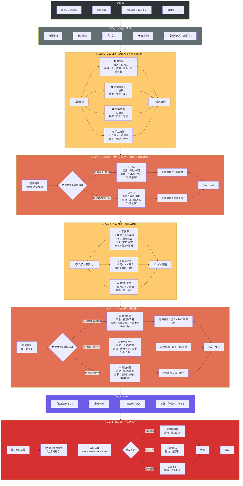
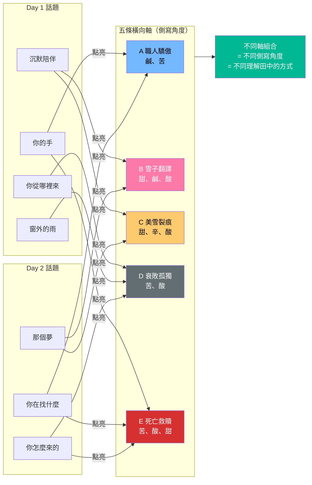
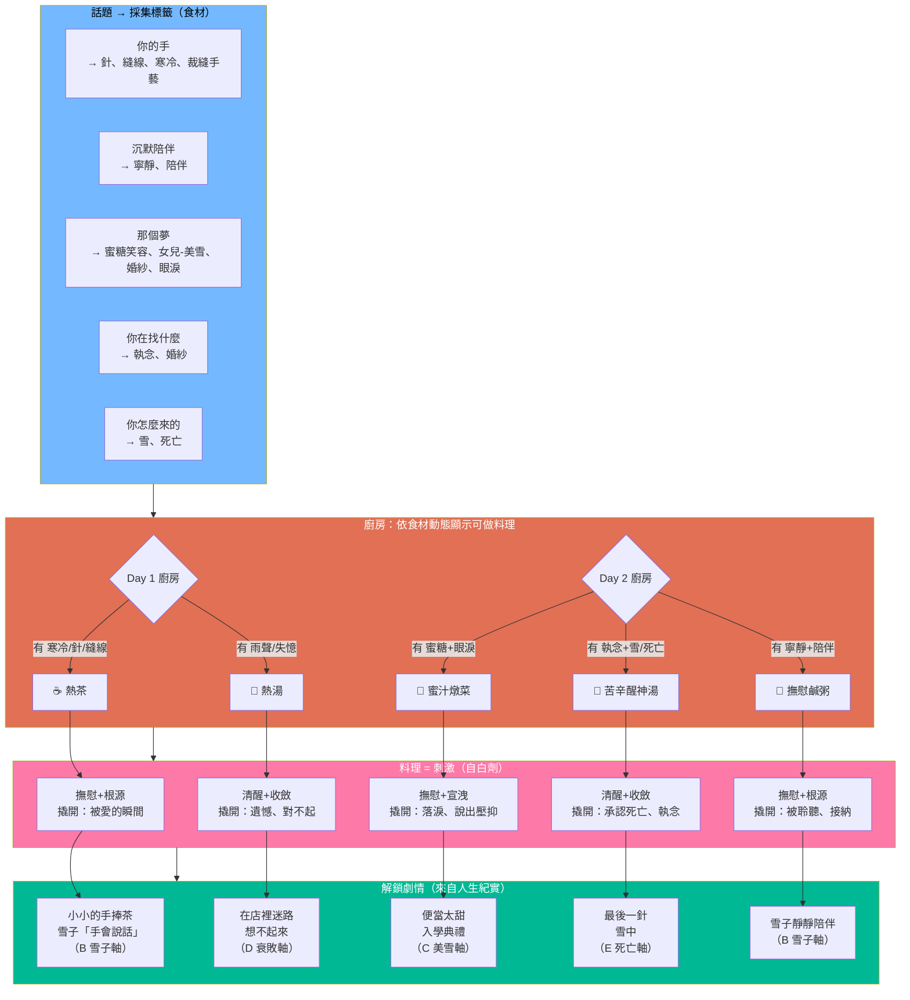
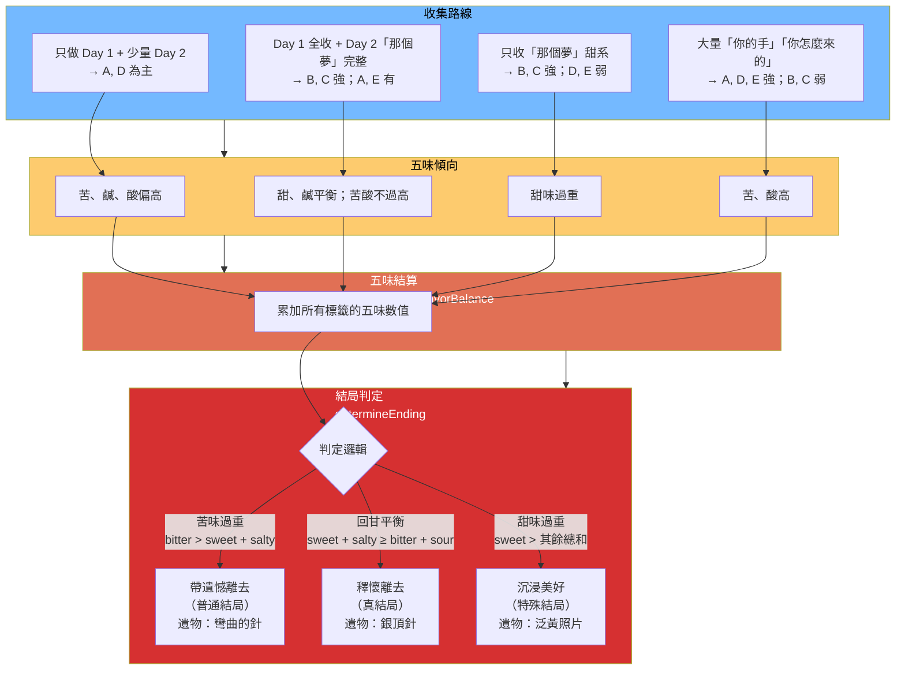
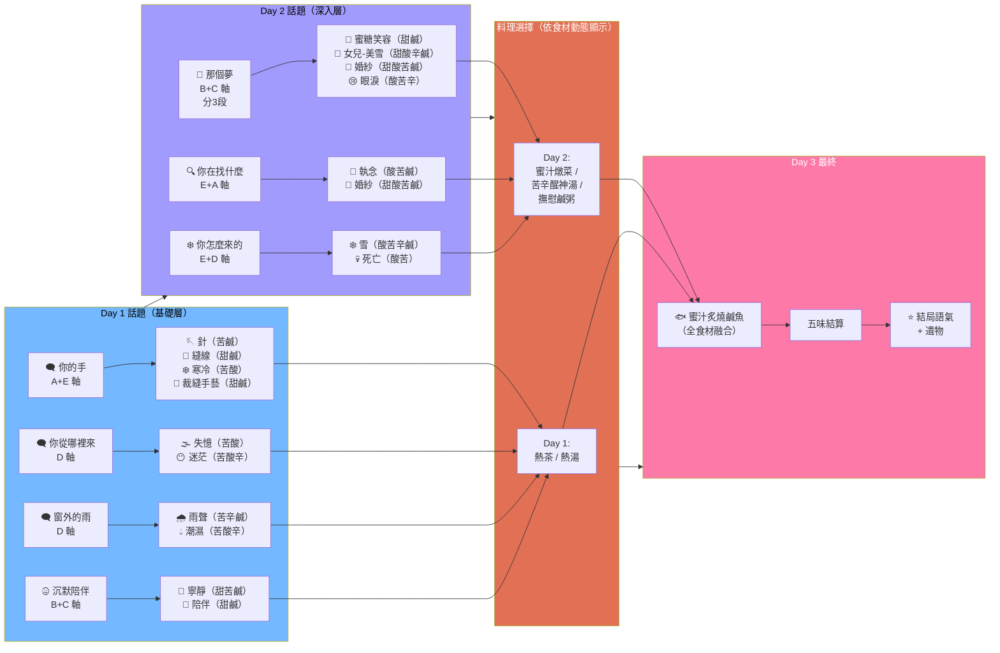
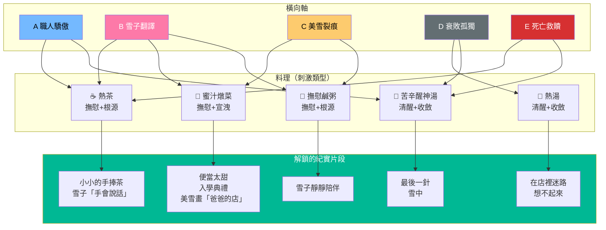
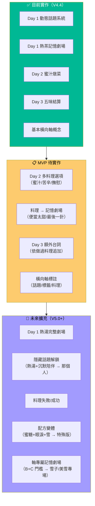

# 田中太郎 - 劇情流程圖（橫向×五味版）

> **依據**：[[../00-核心企劃/當前專案_靈魂食堂/田中太郎_橫向與五味結構]]、[[田中太郎_人生紀實整合建議]]  
> **最後更新**：2026-01-25

---

## 一、主線流程（含橫向軸與料理分支）

---

## 二、橫向軸 × 話題 × 標籤（側寫角度）

---

## 三、食材 → 料理 → 刺激 → 解鎖劇情（料理鏈）

---

## 四、五味結算 → 結局分支

---

## 五、記憶食材收集表（含橫向軸標註）

---

## 六、橫向軸 × 料理 × 解鎖劇情對照

---

## 七、擴展方向（已實現 vs 未來）

---

## 八、關鍵設計要點

### 8.1 橫向（側寫角度）

- **話題選擇 = 點亮橫向軸**：選「你的手」多點亮 A、E；選「沉默陪伴」點亮 B、C
- **同一輪不必全點亮**：不同話題組合 = 不同「理解田中的角度」
- **側寫 ≠ 結局分支**：結局仍由五味決定；橫向只影響「玩家看見了哪幾面」

### 8.2 五味（終局語氣）

- **累積機制**：每獲得一個標籤，依 `MEMORY_FLAVOR_MAP` 累加五味
- **結算時機**：Day 3 告別前 `calculateFlavorBalance()` → `determineEnding()`
- **三種結局**：苦味過重（遺憾） / 回甘平衡（釋懷） / 甜味過重（沉浸美好）

### 8.3 料理鏈（食材 → 刺激 → 解鎖）

- **動態顯示**：廚房依 `collectedMemories` 判斷可做料理，不足配方不顯示
- **不同刺激**：選不同料理 → 不同刺激類型 → 解鎖不同紀實片段
- **三種形式**：記憶劇場不同版本 / 額外台詞 / 隱藏話題

---

## 相關文件

- [[../00-核心企劃/當前專案_靈魂食堂/田中太郎_橫向與五味結構]] — 完整架構說明
- [[田中太郎_人生紀實整合建議]] — 紀實片段對應表
- [[../00-核心企劃/當前專案_靈魂食堂/靈魂食堂：最終開發執行企劃書]] — 五味數值對照表
- [[../01-開發實驗/程式碼/靈魂食堂_田中太郎重構版.gs]] — 實作代碼

#tier2/追蹤
