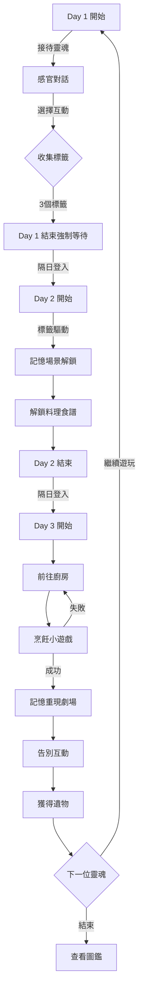

# 靈魂考古 3 日邏輯鏈：基於 Bird Alone 敘事結構的記憶喚起機制

> **設計目標**：將「7日陪伴」壓縮為「3日考古」，強化單位時間的情感濃度  
> **參考原型**：[[孤鳥劇情解析與文字遊戲發想]]、《Bear's Restaurant》、《Spiritfarer》  
> **技術實現**：LINE OA + Google Sheets + 標籤驅動對話  
> **建立日期**：2026-01-15

---

## 🎯 設計哲學：為何是 3 日？

### 從 7 日到 3 日的壓縮邏輯

| 維度 | Bird Alone（7日） | 靈魂食堂（3日） | 設計理由 |
|------|------------------|----------------|----------|
| **敘事結構** | 線性成長 → 衰老 → 死亡 | 記憶喚起 → 執念解開 → 昇華 | 避免「養成疲勞」，聚焦「解謎快感」 |
| **情感曲線** | 緩坡型（漸進式依戀） | 山峰型（集中爆發） | LINE 碎片化使用情境更適合短周期 |
| **重玩動力** | 低（結局重複） | 高（每位靈魂故事不同） | 單元劇結構支撐長期營運 |
| **技術成本** | 7天推播 × N用戶 | 3天推播 × N用戶 | 推播費用降低 **57%** |

**核心洞察**：
> 7 日養成的精髓不在「長度」，而在「階段性的情感轉折」。  
> 將這些轉折濃縮到 3 天，反而能提高「每日必玩」的迫切感。

---

## 📅 3 日敘事框架：感官 → 記憶 → 昇華

### Day 1：感官線索（Sensory Clues）
**敘事目標**：透過五感描述建立角色的「表層印象」

#### 設計原理（參考 Bird Alone）
在 Bird Alone 的前期（Day 1-5），遊戲透過日常問答（「你喜歡什麼顏色？」）建立角色的基礎資料。我們將此轉化為「感官記憶捕捉」。

#### 劇本結構

```yaml
場景設定:
  時間: 黃昏，食堂剛開燈
  氛圍: 橘黃色調，安靜但不陰森
  
靈魂狀態: 
  - 困惑（不記得自己是誰）
  - 對環境有本能反應（聞到某種味道會停頓）

玩家任務:
  - 透過「觀察」與「詢問」收集 5 個感官標籤
  - 標籤類型: [顏色, 溫度, 味道, 聲音, 觸感]
```

#### 對話桶設計（標籤化）

**觸發場景：玩家點擊「接待客人」**

```
【系統】你走近角落的那張桌子。
【靈魂】（低聲）...好冷。

【選項 A】給他一杯熱茶 🍵
【選項 B】拿毛毯給他 🧣
【選項 C】默默坐在旁邊 🪑

--- 若選擇 A ---
【靈魂】（接過茶杯，手指微微顫抖）...這個溫度...好像在哪裡...
【系統】✨ 你捕捉到了「溫暖」的記憶碎片。
【後端】tags += ["warmth"]

--- 若選擇 B ---
【靈魂】（摸著毛毯的質地，突然眼眶濕潤）...羊毛的...我記得這個...
【系統】✨ 你捕捉到了「柔軟」的記憶碎片。
【後端】tags += ["softness"]

--- 若選擇 C ---
【靈魂】（抬頭看你，眼神空洞）...你是誰？
【後端】no_tag_added, 顯示提示：「也許主動做些什麼能幫助他？」
```

#### 技術實現（dialogueLibrary 結構）

**Sheet: dialogueLibrary**

| key | content | trigger_tags | unlock_tags |
|-----|---------|--------------|-------------|
| `guest1_day1_entry` | 「你走近角落的那張桌子。」 | - | - |
| `guest1_day1_cold` | 「（低聲）...好冷。」 | - | - |
| `guest1_day1_tea_response` | 「（接過茶杯，手指微微顫抖）...這個溫度...好像在哪裡...」 | - | `["warmth"]` |
| `guest1_day1_blanket_response` | 「（摸著毛毯的質地，突然眼眶濕潤）...羊毛的...我記得這個...」 | - | `["softness"]` |

#### Day 1 結束條件
- 收集至少 **3 個**感官標籤
- 系統提示：「今天先到這裡吧，明天再來聊聊他的故事。」
- **玩家無法跳過等待**（即使想連續玩也必須等到隔天）

**設計意圖**：強制的等待創造「懸念」與「想念」，這是 Bird Alone 核心機制的移植。

---

### Day 2：記憶拼圖（Memory Callback）
**敘事目標**：將 Day 1 的感官標籤轉化為具體的「生前場景」

#### 設計原理（參考 Bear's Restaurant）
在《熊先生的餐廳》中，玩家會進入死者的記憶碎片，目睹關鍵場景。我們用「對話回溯」模擬這個機制。

#### 劇本結構

```yaml
場景設定:
  時間: 夜深，只有食堂的燈還亮著
  氛圍: 靈魂開始主動說話（不再被動）
  
靈魂狀態:
  - 記憶開始浮現（但順序混亂）
  - 會主動詢問玩家問題（角色轉換）
  
玩家任務:
  - 根據 Day 1 的標籤，解鎖對應的「記憶場景」
  - 從記憶中提取「執念關鍵字」（料理名稱）
```

#### 標籤驅動的動態對話（核心技術）

**觸發邏輯（GAS 後端）**：

```javascript
// 從 userState 讀取玩家收集的標籤
const userTags = JSON.parse(userSheet.getRange(userRow, 4).getValue()); // ["warmth", "softness"]

// 根據標籤組合，匹配對應的記憶場景
const sceneKey = determineScene(userTags);
// 例如：["warmth", "softness"] → "guest1_memory_grandma"

function determineScene(tags) {
  const tagSet = new Set(tags);
  
  // 定義記憶場景的觸發條件（標籤組合）
  if (tagSet.has("warmth") && tagSet.has("softness")) {
    return "guest1_memory_grandma";
  }
  else if (tagSet.has("salty") && tagSet.has("rain")) {
    return "guest1_memory_divorce";
  }
  else {
    return "guest1_memory_default";
  }
}
```

#### 記憶場景範例：奶奶的毛毯

**若玩家 Day 1 收集了 `["warmth", "softness"]`**

```
【靈魂】（突然抓住你的手）等等...我想起來了。
【靈魂】那個味道...是奶奶做的羊肉湯。
【玩家】羊肉湯？
【靈魂】對...冬天的時候，她總是燉一大鍋，然後用舊毛毯蓋在鍋上保溫。
【靈魂】我下課回家，一打開門就能聞到那個味道...
【靈魂】（低下頭）但我最後一次見她的時候...我們吵架了。
【靈魂】因為她堅持要我吃完那碗湯才能出門，但我趕著去見朋友...
【靈魂】我摔門離開了。那碗湯...我一口都沒喝。

【系統】✨ 你解鎖了關鍵記憶：【奶奶的羊肉湯】
【後端】unlockedRecipe = "lamb_soup_grandma"
【後端】emotion = "regret"
```

#### Day 2 結束條件
- 解鎖 **1 個核心記憶**
- 系統獲得「目標料理」的食譜資訊
- 靈魂陷入沉思，玩家被提示：「明天試著做那道料理吧。」

---

### Day 3：料理與超渡（Culinary Redemption）
**敘事目標**：玩家主動烹飪，觸發記憶重現，完成告別儀式

#### 設計原理（參考 Spiritfarer）
《Spiritfarer》的核心在於「放手」。玩家必須親自將靈魂送到「永恆之門」，這個行為本身就是儀式。

#### 劇本結構

```yaml
場景設定:
  時間: 深夜至黎明前（時間流逝感明顯）
  氛圍: 從凝重轉為釋懷
  
靈魂狀態:
  - 等待「那道料理」
  - 已經預感到自己即將離開
  
玩家任務:
  - 前往「廚房」（LIFF 或 Flex Message）
  - 組合食材烹飪
  - 呈上料理並目睹記憶重現
  - 執行「告別互動」
```

#### 烹飪機制（LIFF 小遊戲 或 Quick Reply）

**簡化版（Quick Reply）**：

```
【系統】你站在廚房前。需要的食材：
  - 羊肉 🥩
  - 蘿蔔 🥕
  - 【奶奶的溫柔】（抽象食材）

【Quick Reply】
[開始烹飪] [查看食譜] [放棄]

--- 若點擊「開始烹飪」---
【系統】你想起了靈魂描述的細節...
「要用小火慢燉，不能急」
「最後撒一點點鹽，不能太多」

【選項】火候該用多大？
A. 大火快煮 🔥🔥🔥
B. 小火慢燉 🔥
C. 中火適中 🔥🔥

--- 若選擇 B（正確）---
【系統】✨ 湯汁的顏色漸漸轉為琥珀色，香氣開始蔓延...
【系統】你成功做出了【奶奶的羊肉湯】！

--- 若選擇錯誤 ---
【系統】❌ 湯燒焦了...這不是記憶中的味道。
【系統】要再試一次嗎？
```

#### 記憶重現劇場（Flex Message Carousel）

**當料理成功後，觸發記憶回放**：

```
【Flex Message - Card 1】
[圖片：泛黃的舊照片風格]
「那是一個下著雪的傍晚。」

【Flex Message - Card 2】
[圖片：廚房剪影]
「奶奶蹲在爐子前，拿著勺子嘗味道。」

【Flex Message - Card 3】
[圖片：門口的背影]
「我那時只想著朋友在等我，連頭都沒回。」

【Flex Message - Card 4】
[圖片：空蕩蕩的碗]
「後來...她等我等了一整夜。那碗湯放到涼了。」

【Flex Message - Card 5】
[圖片：靈魂的微笑]
「但是現在，我終於能好好喝完這碗湯了。謝謝你。」
```

#### 告別互動（核心情感節點）

**玩家必須執行的動作**：

```
【靈魂】（拿起碗，慢慢喝完）...嗯，就是這個味道。
【靈魂】我記起來了。不只是湯的味道，還有奶奶的臉...
【靈魂】她那時候沒有生氣，只是很擔心。
【靈魂】（放下碗，站起來）我該走了。

【系統】食堂的後門緩緩打開，外面是一片柔和的光。

【互動提示】長按螢幕，為他送行 →

--- 玩家長按 3 秒 ---
【系統】你感受到溫暖的風吹過...
【靈魂】（回頭微笑）下次不要讓湯涼了喔。
【系統】他化作光點，消失在門外。

【系統】✨ 你獲得了【奶奶的食譜】（遺物）
```

#### Day 3 結束：遺物系統

**後端數據更新**：

```javascript
// 更新 userState
userSheet.getRange(userRow, 6).setValue("guest1_completed");

// 寫入 heirloom（遺物） sheet
const heirloomSheet = ss.getSheetByName("heirlooms");
heirloomSheet.appendRow([
  userId,
  "guest1",
  "lamb_soup_recipe",
  "【奶奶的羊肉湯】食譜",
  "「要用小火慢燉，最後撒一點點鹽。」",
  new Date()
]);
```

**遺物的作用**：
1. 玩家可以在「圖鑑」中回顧所有送走的靈魂
2. 遺物可能包含「通用食材」，用於未來靈魂的料理（Roguelite 元素）
3. 收集一定數量解鎖「真結局」或「老闆的過去」

---

## 🏗️ 技術架構：資料結構設計

### userState Sheet 擴充設計

| 欄位 | 舊設計 (Cloudy V1.4) | 新設計 (靈魂食堂) | 說明 |
|------|---------------------|------------------|------|
| A | user_id | user_id | Line UID |
| B | day | currentDay | 當前遊玩天數（1-3） |
| C | currentMood | guestID | 當前接待的靈魂 ID（如 `guest1`） |
| D | tags | collectedTags | JSON 陣列 `["warmth", "softness"]` |
| E | lastActive | lastActive | 最後互動時間 |
| F | - | **unlockedRecipe** | 已解鎖的料理名稱 |
| G | - | **phase** | 當前階段（`sensory` / `memory` / `cooking`） |
| H | - | **inventory** | JSON 物品庫 `{"lamb":1, "carrot":2}` |

### dialogueLibrary Sheet 標籤化改造

**舊設計問題**：
- `day1_feed_happy` 這種命名綁死在「雲寶」的「餵食」情境
- 無法支援「不同靈魂有不同故事」的需求

**新設計架構**：

| key | content | required_tags | unlock_tags | emotion |
|-----|---------|---------------|-------------|---------|
| `guest1_day1_entry` | 「你走近角落的那張桌子。」 | `[]` | `[]` | neutral |
| `guest1_day2_warmth_softness` | 「我想起來了...奶奶的羊肉湯。」 | `["warmth", "softness"]` | `["memory_grandma"]` | sad |
| `guest2_day1_entry` | 「一個穿著西裝的年輕人坐在吧台。」 | `[]` | `[]` | neutral |
| `guest2_day2_salty_rain` | 「那天下著雨...我們在車裡吵架。」 | `["salty", "rain"]` | `["memory_divorce"]` | regret |

**查詢邏輯（GAS）**：

```javascript
function findDialogue(guestID, day, userTags) {
  const library = getDialogueLibrary();
  const prefix = `${guestID}_day${day}_`;
  
  // 找出所有符合標籤條件的對話
  for (let key in library) {
    if (key.startsWith(prefix)) {
      const required = library[key].required_tags || [];
      if (required.every(tag => userTags.includes(tag))) {
        return library[key];
      }
    }
  }
  
  // 若無匹配，返回預設對話
  return library[`${guestID}_day${day}_default`];
}
```

---

## 🎨 Flex Message 視覺設計規範

### 1. 靈魂人物卡（Day 1 開場）

```json
{
  "type": "bubble",
  "hero": {
    "type": "image",
    "url": "https://example.com/guest1_silhouette.png",
    "size": "full",
    "aspectRatio": "20:13"
  },
  "body": {
    "type": "box",
    "layout": "vertical",
    "contents": [
      {
        "type": "text",
        "text": "??? 號靈魂",
        "weight": "bold",
        "size": "xl"
      },
      {
        "type": "text",
        "text": "「...好冷。」",
        "wrap": true,
        "color": "#666666"
      }
    ]
  },
  "footer": {
    "type": "box",
    "layout": "vertical",
    "contents": [
      {
        "type": "button",
        "action": {
          "type": "message",
          "label": "給他熱茶",
          "text": "[行動-熱茶]"
        },
        "style": "primary"
      }
    ]
  }
}
```

### 2. 記憶劇場（Day 3 Flashback）

使用 **Carousel 輪播**：
- 每張卡片 = 一個記憶片段
- 卡片背景使用「泛黃紙張」濾鏡
- 最後一張卡片是「前往來世之門」按鈕

---

## 📊 玩家體驗流程圖



---

## ⚡ 與 Bird Alone 的關鍵差異對照表

| 維度 | Bird Alone | 靈魂食堂 | 設計意圖 |
|------|-----------|---------|---------|
| **時間綁定** | 現實時間（1天=1遊戲日） | 回合制（玩家控制節奏） | 降低焦慮感 |
| **角色壽命** | 固定30天後死亡 | 3天完成即離開 | 提高重玩率 |
| **情感核心** | 「失去無法挽回」 | 「送行是圓滿」 | 療癒而非創傷 |
| **玩家角色** | 被動陪伴者 | 主動救贖者 | 賦予玩家能動性 |
| **重複遊玩** | 無（角色死後重置） | 有（每位靈魂不同） | 長期營運可能 |

---

## 🔐 防止「出戲」的設計細節

### 問題 1：玩家跳過劇情狂點
**解決**：
- 關鍵劇情使用「長按 3 秒」而非單點
- Flex Message 的文字不可複製，必須閱讀

### 問題 2：玩家亂輸入文字測試 AI
**解決**：
- 明確告知「這是腳本遊戲，請使用選單互動」
- 自由文字輸入僅限「命名」或「留言」環節

### 問題 3：一口氣玩完 3 天
**解決**：
- 強制隔日解鎖（檢查 `lastActive` 日期差）
- Day 1 完成後，Rich Menu 鎖定「接待客人」按鈕

---

## 📋 下一步開發檢查清單

- [ ] 撰寫 Guest 1「奶奶的羊肉湯」完整劇本（3日 × 5個對話節點 = 15個 dialogue entries）
- [ ] 設計 Guest 2「離婚的鹹味記憶」備用劇本
- [ ] 實作 `findDialogue()` 標籤匹配引擎
- [ ] 設計 LIFF 烹飪小遊戲原型（或 Quick Reply 簡化版）
- [ ] 繪製 Flex Message 視覺素材（靈魂剪影、記憶場景）
- [ ] 測試「強制等待」邏輯（避免時區問題）

---

**文件狀態**：🟢 Active  
**對應技術文件**：[[專案實作對照表]]  
**最後更新**：2026-01-15

