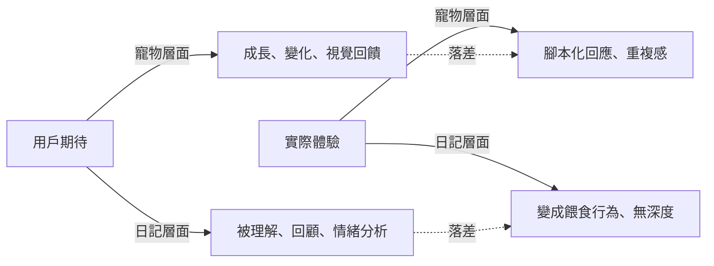

# 敘事機制：載體與體驗的裂縫

#敘事機制 #產品定位

> 原子筆記 | 來源：雲寶時代的 AI 對談  
> 建立日期：2026-01-15

---

## 核心問題

**「以電子寵物包裝的日記」產生了產品裂縫**

> 「很多原因這個『以電子寵物包裝的日記』產生了產品裂縫」  
> —— AI對談紀錄第 27 行

---

## 裂縫本質

### 期待落差分析

### 問題診斷

1. **寵物不夠「寵物」**：
   - 缺乏視覺化的成長反饋
   - 互動方式單一（文字輸入）
   - 無法看到寵物的狀態變化

2. **日記不夠「日記」**：
   - 無法回顧過往記錄
   - 缺乏情緒分析與統計
   - 輸入的文字沒有被「深度處理」的感覺

---

## 解決方案演變

### 方案 A：強化寵物面（放棄）
- 增加 Live2D 動畫
- 設計房間佈置系統
- **問題**：開發成本暴增，違反「成本優先原則」

### 方案 B：強化日記面（放棄）
- 改成完整的日記 App
- 增加搜尋、標籤、統計功能
- **問題**：失去「陪伴感」，變成工具而非遊戲

### 方案 C：轉型為「敘事遊戲」（採納）
- 引入劇情框架（記憶考古、靈魂擺渡）
- 文字輸入變成「解謎線索」而非單純的日記
- 寵物變成「故事角色」而非養成對象
- **優勢**：既有情感深度，又有明確的遊玩目標

---

## 核心洞察

**載體選擇必須與產品定位自洽**

- 如果定位是「日記工具」→ 應該是獨立 App，不是 LINE Bot
- 如果定位是「電子寵物」→ 應該有豐富的視覺互動
- 如果定位是「敘事遊戲」→ LINE OA 的文字介面剛好合適

最終選擇「敘事遊戲」，因為它能在 LINE 的限制下發揮最大價值。

---

## 相關筆記

- [[../../00-核心企劃/開發決策鏈]]

