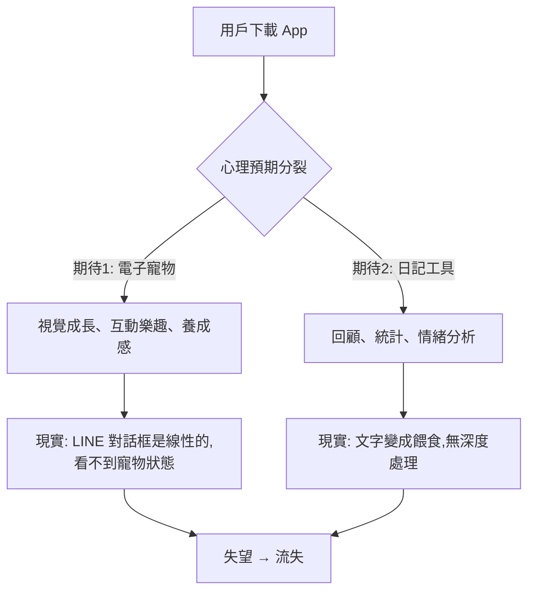

# 產品規劃轉變脈絡：從「雲寶」到「靈魂食堂」的決策考古

> **文件性質**: 決策追溯與邏輯重構  
> **建立日期**: 2026-01-17  
> **標籤**: #決策邏輯 #產品演化 #為何轉型

---

## 📋 文件目的

本文件回答一個核心問題:

> **「為什麼我們要放棄已經開發到 V1.4 的『雲寶寵物』,轉型為『靈魂食堂』?」**

這不僅是技術決策,更是對**產品靈魂**的重新定義。  
這份決策將成為未來所有程式碼生成的**邏輯依據**。

---

## 🎭 轉型的三大核心原因

### 原因 1: 產品裂縫 - 雙重期待的不可調和性

#### 問題診斷

當我們說「以電子寵物包裝的日記」時,我們創造了一個**認知困境**:



**具體表現**:

| 用戶期待 | 雲寶 V1.4 的現實 | 差距本質 |
|---------|----------------|---------|
| 🐾 **期待寵物會「長大」** | ❌ 對話框無法展示成長過程 | LINE 載體限制 |
| 💬 **期待對話有「記憶」** | ⚠️ 僅記住單一標籤,無深度引用 | 數據結構過簡 |
| 📊 **期待有「情緒分析」** | ❌ 無任何統計或回顧功能 | 未實作 |
| 🎯 **期待有「養成目標」** | ❌ 7 天後重複劇情,無新內容 | 重玩性低 |

#### 為何無法修補?

我們曾嘗試:
- **V1.1**: 增加更多寵物狀態描述 → 依然看不到視覺變化
- **V1.2**: 加入標籤記憶系統 → 但無法建立「長期情感連結」
- **V1.3**: 轉型為「會問問題的樹洞」→ 失去了「寵物感」

**結論**: 不是技術問題,是**產品定位的自我矛盾**。  
LINE OA 適合「劇情遊戲」,不適合「養成遊戲」。

參考: [[../00-工作區/架構診斷報告_2026-01-15#斷層 1：版本不一致|診斷報告 - 產品裂縫分析]]

---

### 原因 2: 技術債務 - 代碼無法承載願景

#### 數據結構的天花板

雲寶 V1.4 的 `userState` 只有 **3 欄**:

```
A: userId
B: currentDay (1-7)
C: currentMood (happy/sad/angry)
```

這導致我們**無法實作**:
- ✗ 多角色系統 (沒有 `guestID`)
- ✗ 標籤累積與組合觸發 (沒有 `collectedTags`)
- ✗ 跨日劇情鎖定 (沒有 `lastActive` 時間戳)
- ✗ 料理解鎖與合成 (沒有 `unlockedRecipe` 與 `inventory`)
- ✗ 成就與遺物系統 (沒有 `completedGuests` 與 `heirlooms`)

**技術債務評估表**:

| 想實作的功能 | V1.4 能否支援? | 需要的改動 |
|-------------|--------------|-----------|
| 靈魂記住玩家的 3 次選擇 | ❌ | 需擴充 JSON Array 欄位 |
| 標籤組合觸發特殊劇情 | ❌ | 需新增標籤查詢函數 |
| 強制隔日解鎖 (宿命感) | ❌ | 需時間戳與邏輯判斷 |
| 多位靈魂輪替 | ❌ | 需 guestID 與配置表 |
| 遺物收藏與圖鑑 | ❌ | 需獨立 Sheet 與關聯邏輯 |

**結論**: 若要實現「五味考古」與「標籤驅動對話」,**必須從數據結構根本重構**。  
這不是「修修補補」能解決的,是「砍掉重練」的必要性。

參考: [[../01-開發實驗/專案實作對照表#債務 1：程式碼版本落後|實作對照表 - 技術債務]]

---

### 原因 3: 敘事深度 - 從「陪伴」到「見證」

#### 情感設計的範式轉移

**舊範式: 雲寶 (陪伴型寵物)**
- 玩家目標: 讓寵物開心
- 關係結構: 單向給予 (玩家 → 寵物)
- 情感體驗: 溫暖但淺層
- 時間線: 無限循環,無終點

**新範式: 靈魂食堂 (見證型敘事)**
- 玩家目標: 理解靈魂,助其解脫
- 關係結構: 雙向見證 (玩家 ↔ 靈魂)
- 情感體驗: 溫暖但具重量 (Warm Weight)
- 時間線: 3 日完整弧線,必然告別

#### 為何「見證」比「陪伴」更深刻?

| 維度 | 陪伴 (雲寶) | 見證 (靈魂食堂) |
|------|-----------|---------------|
| **玩家角色** | 主人/飼主 (權力高位) | 罪名吞噬者 (服務者) |
| **NPC 需求** | 「我餓了」「我無聊」 | 「我忘記了我是誰」「我做錯了什麼」 |
| **互動深度** | 餵食 → 回應 (反射式) | 對話 → 推理 → 共鳴 (理解式) |
| **情感張力** | 避免寵物不開心 | 必須放手讓靈魂離開 |
| **不可逆性** | 無 (可重來) | 有 (告別後無法復見) |

#### 參考原型: Bird Alone 的啟示

《Bird Alone》教會我們:
1. **有限性創造價值**: 鳥兒會死,所以每一天都珍貴
2. **不可逆創造重量**: 離別無法撤銷,所以深刻
3. **哲學對話創造深度**: 討論死亡、孤獨、意義,超越「今天吃什麼」

**我們的進化方案**:
- 保留: 每日互動、文字為核心、情感陪伴
- 升級: 從「單一角色永生」→「多位靈魂,各自完整弧線」
- 創新: 加入「五味診斷」的推理玩法,不只是被動陪伴

參考: [[../02-研究分析/企劃書與Bird Alone結合探討#2.1 《Bird Alone》的心理學機制|Bird Alone 分析]]

---

## 🔀 轉型決策時間軸

### 決策點 0: AI 即時生成的放棄 (理論階段)
**時間**: 2025-12 (企劃初期)  
**原始假設**: 用 OpenAI API 讓 AI 理解玩家日記並即時回應  
**放棄原因**:
- Token 成本不可控 (1000 用戶 × 30 天 = $150-300/月)
- 玩家輸入品質無法保證 (垃圾輸入導致無意義回應)
- AI 回應品質不穩定 (可能洩漏「我是 AI」或破壞人設)

**決策**: 採用「腳本式文字遊戲 + 關鍵字觸發」混合架構

參考: [[../00-核心企劃/開發決策鏈#決策點 0|決策鏈 - AI 方案放棄]]

---

### 決策點 1: LINE OA 作為載體 (載體選擇)
**時間**: 2026-01-05  
**選擇理由**:
- 市場滲透: LINE 在台灣最多人用
- 開發速度: 不用寫 App,快速驗證
- 成本控制: Reply API 免費 (vs Push API 計費)

**隱含風險**:
- 介面限制: 無法做複雜視覺互動
- 注意力分散: 用戶被大量聊天干擾

**應對策略**:
- 採用「拉取式」設計 (玩家主動觸發)
- 強制跨日鎖定 (避免一次玩完失去期待)

參考: [[../00-核心企劃/開發決策鏈#決策點 1|決策鏈 - 載體選擇]]

---

### 決策點 2: 從「電子寵物日記」到「文字遊戲」(產品定位修正)
**時間**: 2026-01-10  
**觸發原因**: 內部測試發現「寵物感不足,日記感也不足」  
**診斷結果**: 產品裂縫 (雙重期待的不可調和)

**解決方案演變**:
- ❌ V1.0-V1.2: 強化寵物視覺 → 失敗 (LINE 限制)
- ⚠️ V1.3: 轉型為「樹洞」→ 部分成功但缺乏目標
- ✅ V1.4 → V4.0: 徹底轉型為「敘事遊戲」

**轉型方向探索**:
引入 4 種敘事框架候選:
1. 記憶考古學 (Memory Archaeology)
2. 時間迴圈解謎 (Time Loop Mystery)
3. **靈魂擺渡模擬 (Soul Ferrying)** ← 最終選擇
4. 非同步善意交換 (Kindness Exchange)

參考: [[../00-核心企劃/開發決策鏈#決策點 2|決策鏈 - 產品定位裂縫]]

---

### 決策點 3: 「靈魂擺渡」的選定 (核心機制確立)
**時間**: 2026-01-12  
**選擇原因**:

| 評估維度 | 記憶考古 | 時間迴圈 | **靈魂擺渡** | 善意交換 |
|---------|---------|---------|------------|---------|
| 情感深度 | ⭐⭐⭐ | ⭐⭐⭐⭐ | ⭐⭐⭐⭐⭐ | ⭐⭐⭐ |
| 開發成本 | 中 | 高 | **中** | 低 |
| 文化共鳴 | 低 | 中 | **高** (生死議題普世) | 中 |
| 重玩性 | 低 | 高 | **高** (多位靈魂) | 中 |

**核心吸引力**:
- 「料理」作為隱喻載體 (普世文化符號)
- 「告別」作為情感高潮 (Bird Alone 驗證有效)
- 「診斷-治療」的推理玩法 (超越單純對話)

**世界觀原型整合**:
- 《Bear's Restaurant》: 料理喚醒記憶
- 《Spiritfarer》: 靈魂擺渡與告別儀式
- 《Venba》: 料理與文化記憶
- + 中醫五行診斷邏輯 (獨創融合)

參考: [[../02-研究分析/靈魂食堂企劃重構#執行摘要|企劃重構 - CONFITEOR 概念]]

---

### 決策點 4: 五味診斷系統的引入 (機制深化)
**時間**: 2026-01-14  
**觸發原因**: 單純「點選對話」過於簡單,缺乏挑戰性

**設計邏輯**:
1. **問題**: 如何讓玩家「主動思考」而非「被動點選」?
2. **靈感來源**: 中醫的「望聞問切」+ 神經美食學
3. **機制設計**: 
   - 靈魂的「點餐」是表層防衛
   - 玩家需透過觀察與推理找出「真正需要的五味」
   - 正確診斷 → 記憶解鎖 / 錯誤診斷 → 靈魂更困惑

**五味映射邏輯**:

| 五味 | 中醫對應 | 情感治療功能 | 遊戲機制意義 |
|------|---------|------------|------------|
| 甜 | 土/脾 | 撫慰焦慮 | 建立信任的基礎 |
| 酸 | 木/肝 | 收斂悔恨 | 引導靈魂正視錯誤 |
| 苦 | 火/心 | 打破執念 | 終結自我欺騙 |
| 辛 | 金/肺 | 宣洩悲傷 | 強制情感流動 |
| 鹹 | 水/腎 | 喚醒記憶 | 觸及根源創傷 |

**為何不用西方心理學框架?**
- 中醫五行更詩意,適合隱喻表達
- 「診斷」概念自帶神秘感與專業感
- 與「料理」自然結合 (食材本身有五味)

參考: [[../02-研究分析/靈魂食堂企劃重構#3.1 五味映射表|企劃重構 - 五味診斷系統]]

---

### 決策點 5: 標籤考古玩法 (避免 NLP 依賴)
**時間**: 2026-01-15  
**問題**: 如何在「不用 AI」的前提下,讓玩家感覺「對話有意義」?

**解決方案: 標籤採集 (Tag Foraging)**
- 對話中的關鍵字以特殊格式標示 (如 `【雪】`、`【火】`)
- 玩家點擊採集,系統記錄至 `collectedTags`
- 標籤組合觸發不同劇情分支

**設計優勢**:
1. **無需 NLP**: 關鍵字由企劃預先標註
2. **玩家主動性**: 選擇採集哪些標籤 = 選擇理解方向
3. **推理感**: 需判斷哪些標籤是「真實」,哪些是「防衛」
4. **變量插值**: 標籤可回填至後續對話 (`「記得你提過的{tag}嗎?」`)

**靈感來源**:
- 《Cultist Simulator》: 抽象卡牌合成
- 《Hades》: 祝福組合觸發特殊對話
- 《80 Days》: 關鍵字驅動分支敘事

參考: [[../01-開發實驗/專案實作對照表#三、dialogueLibrary Sheet|實作對照表 - 標籤系統]]

---

## 🎯 轉型後的核心優勢

### 優勢 1: 明確的產品定位
**雲寶時代**: 「這是寵物?還是日記?」 → 用戶困惑  
**靈魂食堂**: 「這是敘事遊戲,類似互動小說」 → 清晰認知

### 優勢 2: 可擴展的架構
**雲寶時代**: 3 欄數據,無法支撐複雜玩法  
**靈魂食堂**: 10 欄數據 + 4 個輔助 Sheets,支援:
- 多位靈魂輪替
- 標籤組合觸發
- 遺物收藏系統
- 多結局分支

### 優勢 3: 深刻的情感體驗
**雲寶時代**: 「今天開心嗎?」(表層)  
**靈魂食堂**: 「你忘記了什麼?你遺憾什麼?」(深層)

參考 Bird Alone 的成功: 敢於觸碰「死亡」與「孤獨」,反而創造更強連結。

### 優勢 4: 重玩價值
**雲寶時代**: 7 天後劇情重複  
**靈魂食堂**: 
- 每位靈魂 3 天完整弧線
- 10+ 位不同靈魂 = 30+ 天內容
- 隱藏靈魂解鎖機制
- 遺物收藏驅動

---

## ⚠️ 轉型風險與應對

### 風險 1: 「死亡議題」過於沉重?
**擔憂**: 玩家可能覺得壓抑,不想玩

**應對策略**:
1. **溫暖包裝**: 使用「食堂」而非「靈堂」,爐火而非冰冷
2. **敘事安全閥**: 沉重對話後,切換到「廚房」進行邏輯操作,緩衝情緒
3. **參考成功案例**: 
   - 《Spiritfarer》: 死亡議題但溫暖治癒,獲獎無數
   - 《Bear's Restaurant》: 手機遊戲,死亡題材,高評價

**結論**: 關鍵不是「避開死亡」,而是「如何處理死亡」。  
我們選擇「見證而非審判」、「溫暖但具重量」的基調。

參考: [[../02-研究分析/靈魂食堂企劃重構#1.1 從「審判」到「見證」的範式轉移|企劃重構 - 溫暖與重量]]

---

### 風險 2: 開發成本暴增?
**擔憂**: 多位靈魂 = 多倍劇本量

**應對策略**:
1. **模板化設計**: 
   - 3 日流程固定 (誘捕 → 偵訊 → 赦免)
   - 標籤驅動對話,而非窮舉所有組合
2. **優先級控制**:
   - Phase 1: 只做 Guest 1 (證明概念)
   - Phase 2: 再做 Guest 2-3 (驗證系統可擴展)
3. **工具賦能**:
   - 使用 Google Sheets 作為「低代碼劇本編輯器」
   - 企劃可直接填表,無需改代碼

參考: [[../01-開發實驗/專案實作對照表#Q3：企劃說「要有 10 個不同的靈魂故事」,需要改多少代碼？|實作對照表 - 可擴展性]]

---

### 風險 3: LINE 平台限制?
**擔憂**: 無法做複雜互動,體驗受限

**應對策略**:
1. **現階段**: 善用 Flex Message 做視覺化
   - 人物卡、記憶劇場、遺物卡
2. **進階方案**: LIFF 嵌入式網頁
   - 料理合成小遊戲
   - 食堂外觀隨情緒變化
3. **接受限制**: 
   - 我們不做「料理模擬器」(無需切菜動作)
   - 我們做「概念煉金術」(標籤合成即可)

**哲學**: 限制不是敵人,是設計方向的指引。  
LINE 的限制逼我們專注於「文本」與「情感」,反而強化了核心優勢。

參考: [[../04-資源素材/技術成本_非即時制設計的優勢|非即時制設計哲學]]

---

## 📊 轉型成功指標

### 定性指標 (我們是否做對了?)
- ✅ 測試者是否在告別時感到「不捨但釋然」?
- ✅ 是否有「我想再見一次那位靈魂」的反饋?
- ✅ 是否有人主動分享遺物卡片?
- ✅ 是否有人詢問「還有其他靈魂嗎?」

### 定量指標 (市場驗證)
- Day 1 → Day 2 留存率 > 70%
- Day 2 → Day 3 留存率 > 60%
- 完整通關率 > 50%
- 料理成功率 > 80% (太難會挫折)

---

## 🎬 下一步行動

### 立即執行 (本週)
1. ✅ 建立此決策脈絡文件
2. [ ] 重構 `userState` 至 10 欄
3. [ ] 實作跨日鎖定機制
4. [ ] 完成 Guest 1 劇本填充

### 驗證假設 (下週)
- 進行「人肉 Bot」測試 (開發者手動扮演系統)
- 驗證「五味診斷」是否有趣
- 驗證「3 日節奏」是否合理

### 持續追蹤
- 每次 Sprint 結束後,回顧此文件
- 若發現新的「為何轉型」的理由,補充進來
- 若發現轉型決策有誤,誠實記錄並修正

---

## 📚 相關文件索引

- [[靈魂食堂：最終開發執行企劃書|最終執行企劃書]] - 轉型後的完整規劃
- [[../00-核心企劃/開發決策鏈|開發決策鏈]] - 詳細的決策時間軸
- [[../00-工作區/架構診斷報告_2026-01-15|架構診斷報告]] - 轉型的技術必要性
- [[../02-研究分析/靈魂食堂企劃重構|企劃重構文件]] - CONFITEOR 世界觀完整版

---

**文件信念**:

> 「好的決策不是避免錯誤,而是誠實面對錯誤並及時修正。」  
> 「轉型的勇氣來自於對『為何存在』的深刻反思。」  
> 「靈魂食堂不是雲寶的失敗,而是雲寶教會我們的進化。」

---

**文件狀態**: 🟢 Active  
**最後更新**: 2026-01-17  
**維護者**: 專案負責人  
**下次回顧**: 每次重大決策後

